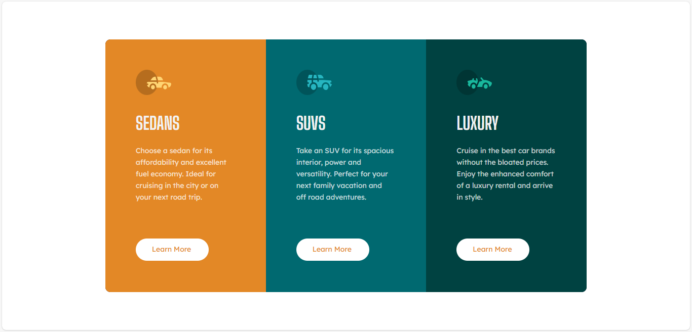

# Frontend Mentor - 3-column preview card component solution

This is a solution to the [3-column preview card component challenge on Frontend Mentor](https://www.frontendmentor.io/challenges/3column-preview-card-component-pH92eAR2-). Frontend Mentor challenges help you improve your coding skills by building realistic projects. 

## Overview
- Responsive Layout – Flexbox-based structure that adapts across devices.
- Custom Google Fonts – Uses Lexend Deca for body text and Big Shoulders Display for headings.
- Three-Column Card Design – Each card has its own color, icon, and content.
- Smooth Hover Transitions – Button transitions with color and border effects.
- Reusable CSS Classes – Modular class structure for easy editing and scalability.

### The challenge
Users should be able to:
- View the optimal layout depending on their device's screen size
- See hover states for interactive elements

### Screenshot

### Links

### Built with
- Semantic HTML5 markup
- CSS custom properties
- Flexbox
- CSS Grid

## Author
- Aisha Adeyemo
- Frontend Mentor - (https://www.frontendmentor.io/profile/echo-script0)